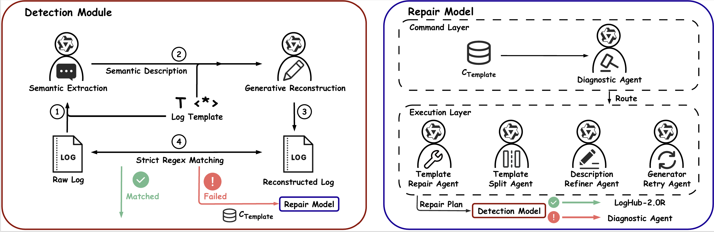

# LogTR: Refining Noisy Templates in Log Parsing Benchmarks via Generative Verification

## Overview

Log parsing serves as the foundation for automated log analysis by transforming semi-structured raw logs into structured templates and parameters. However, we discovered substantial **structural label noise** in LogHub-2.0, the most authoritative benchmark, including missing structures, syntax errors, and over-merging of templates.

### Key Results

- Successfully identified and repaired **493 templates** containing structural noise
- Recovered **20 templates** lost due to over-merging
- Refined **14.7%** of templates in LogHub-2.0
- Released **LogHub-2.0R(https://github.com/LogTR/LogHub-2.0R)**, a refined benchmark dataset

## Framework Architecture



LogTR comprises two primary modules:

### Detection Module

The Detection Module leverages LLMs' sensitivity to structural constraints to construct an automated binary verifier. It cascades two core steps:

1. **Semantic Extraction**: Strips syntactic structures from raw logs and extracts core semantics
2. **Generative Reconstruction**: Restores semantics to logs under rigid structural constraints of the template

When the template is correct, reconstruction is a simple slot-filling task. When the template contains structural noise, reconstruction fails, providing a robust signal for identifying anomalies.

### Repair Module

The Repair Module adopts a multi-agent collaboration architecture guided by an FSM. It includes:

- **Diagnostic Agent** (Command Layer): Analyzes anomaly causes and designates repair strategies
- **Template Repair Agent**: Repairs templates with missing structures or parameters
- **Template Split Agent**: Decouples over-merged templates using parameter distribution analysis
- **Description Refiner Agent**: Optimizes descriptions via context augmentation
- **Generator Retry Agent**: Mitigates hallucinations through few-shot demonstrations

## Installation

```bash
pip install -r requirements.txt
```

## Configuration

Configure your API keys in the respective Python files before use:

```python
QWEN_API_KEY = "your-api-key"
DEEPSEEK_API_KEY = "your-api-key"
CLAUDE_API_KEY = "your-api-key"
GEMINI_API_KEY = "your-api-key"
GPT_API_KEY = "your-api-key"
```

Also configure the `base_url` for each provider in `llm_client.py`.

## Usage

LogTR consists of three main components corresponding to the framework modules:

### 1. Semantic Extraction (`semantic_extraction.py`)

Corresponds to the **Semantic Extraction** step in the Detection Module. This script uses LLMs to extract core semantics from raw logs, stripping syntactic structures while preserving parameter values.

### 2. Generative Reconstruction (`generative_reconstruction.py`)

Corresponds to the **Generative Reconstruction** step in the Detection Module. This script attempts to restore logs from semantic descriptions under rigid template constraints, identifying reconstruction failures as anomaly signals.

### 3. Auto Repair (`auto_repair_failed.py`)

Implements the **Repair Module** with FSM-guided multi-agent collaboration. This script automatically diagnoses failure causes and routes tasks to specialized agents (Template Repair Agent, Template Split Agent, Description Refiner Agent, Generator Retry Agent).


## Project Structure

```bash
├── code/
│   ├── semantic_extraction.py       # Detection Module: Semantic Extraction
│   ├── generative_reconstruction.py # Detection Module: Generative Reconstruction
│   ├── auto_repair_failed.py        # Repair Module: FSM-guided Multi-Agent System
│   ├── llm_client.py                # LLM client for multiple providers
│   ├── check_all_logs.py            # Utility: Check pattern matching in logs
│   ├── get_all_you_want_log.py      # Utility: Extract logs by event ID
│   ├── extract_log_context.py       # Utility: Extract log context
│   └── golden_few_shots.json        # Few-shot examples for each system
├── fig/
│   └── LogTR.png                    
├── tables/
│   ├── README.md                    
│   └── tex/                         # LaTeX table sources
├── requirements.txt                 
├── LICENSE                          
└── README.md                        
```


## License

This project is open source. Please refer to the LICENSE file for details.

